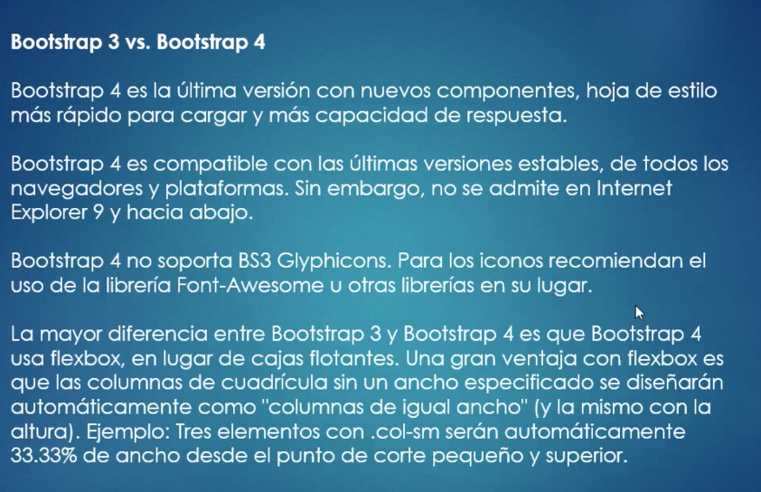
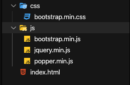
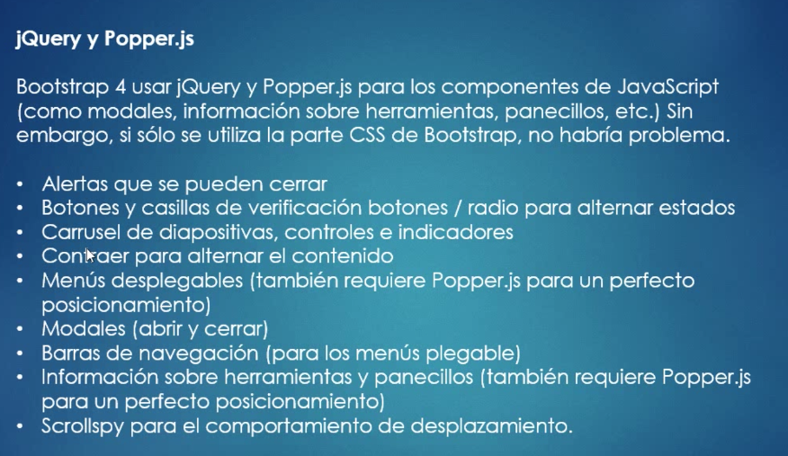
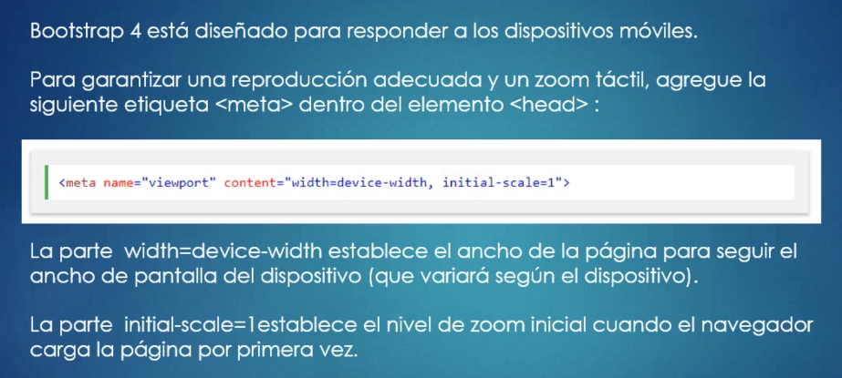
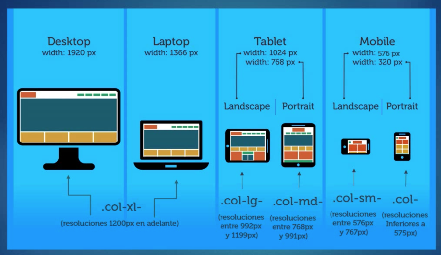
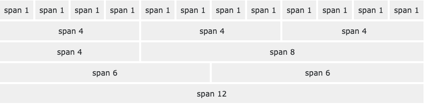
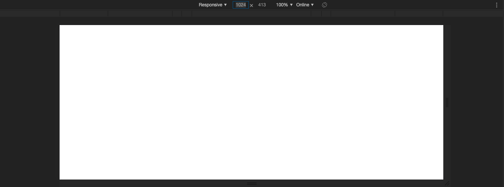

# 2. Bootstrap 4 01:13:49

Referencias

https://getbootstrap.com/

https://www.w3schools.com/bootstrap4/

http://bootstrap4.guide/

https://w3layouts.com/


## ¿Qué es Bootstrap? 07:20

* Bootstrap es un marco de trabajo o framework de libre uso para hacer del desarrollo web algo más rápido y más fácil.
* Bootstrap incluye plantillas de diseño basadas en HTML y CSS con tipografías, formas, botones, tablas de navegación modales, carruseles de imágenes y muchos otros elementos, así como complementos opcionales de JS.
* Bootstrap también da la posibilidad de crear fácilmente diseños que responden a cualquier pantalla o dispositivo.




## Instalación de Bootstrap 4 11:26


### 1. Usando CDN

Insertamos el código MaxCDN ([página](https://www.w3schools.com/bootstrap4/bootstrap_get_started.asp)) dentro del header.

`index.html`:

```html
<!DOCTYPE html>
<html lang="en">
<head>
    <meta charset="UTF-8">
    <meta name="viewport" content="width=device-width, initial-scale=1.0">
    <meta http-equiv="X-UA-Compatible" content="ie=edge">
    <title>Document</title>

    <!-- Latest compiled and minified CSS -->
    <link rel="stylesheet" href="https://maxcdn.bootstrapcdn.com/bootstrap/4.4.1/css/bootstrap.min.css">

    <!-- jQuery library -->
    <script src="https://ajax.googleapis.com/ajax/libs/jquery/3.4.1/jquery.min.js"></script>

    <!-- Popper JS -->
    <script src="https://cdnjs.cloudflare.com/ajax/libs/popper.js/1.16.0/umd/popper.min.js"></script>

    <!-- Latest compiled JavaScript -->
    <script src="https://maxcdn.bootstrapcdn.com/bootstrap/4.4.1/js/bootstrap.min.js"></script>
</head>
<body>
    
</body>
</html>
```

### 2. Forma Local

Para instalar localmente Bootstrapt tengo que crearme una estructura como la siguiente e copiar los archivos CSS y JS a la carpeta correspondiente.



Y en mi archivo HTML hacer el llamado a mis archivos locales:

```html
<!DOCTYPE html>
<html lang="en">
<head>
    <meta charset="UTF-8">
    <meta name="viewport" content="width=device-width, initial-scale=1.0">
    <meta http-equiv="X-UA-Compatible" content="ie=edge">
    <title>Document</title>

    <!-- Latest compiled and minified CSS -->
    <link rel="stylesheet" href="css/bootstrap.min.css">

    <!-- jQuery library -->
    <script src="js/jquery.min.js"></script>

    <!-- Popper JS -->
    <script src="js/popper.min.js"></script>

    <!-- Latest compiled JavaScript -->
    <script src="js/bootstrap.min.js"></script>
</head>
<body>
    
</body>
</html>
```



[Referencias](https://www.w3schools.com/bootstrap4/bootstrap_ref_all_classes.asp)

## Sistema de Grids (Rejillas) 19:05

[Grid System](https://www.w3schools.com/bootstrap4/bootstrap_grid_basic.asp)



```html
<meta name="viewport" content="width=device-width, initial-scale=1">
```
[Código tomado de 2. **Bootstrap 4 is mobile-first**](https://www.w3schools.com/bootstrap4/bootstrap_get_started.asp)

Este código va dentro de la HEAD.



En el sistema de Grids o Rejillas Bootstrap usa un máximo de 12 columnas.

Independiente del tamaño de pantalla nosotros trabajaremos con columnas.



Me puedo auxiliar de las herramientas de desarrollador para ver el Diseño Responsive y cambiar a los tamaños de resoluciones permitidos.

* Full HD - HD: 1920px
* Portatil: 1366px
* Tablet Horizontal: 1024px
* Tablet Vertical 768px
* Móvil Horizontal: 576px
* Móvil Vertical: 320px



**En cualquiera de estos 12 tamaños puedo tener hasta 12 columnas**


## Las Clases CSS de Bootstrap 4 - Parte 1 18:43

## Las Clases CSS de Bootstrap 4 - Parte 2 13:50

## Diviértete con Bootstrap 4 03:25

## Aterrizando conceptos de Bootstrap 4 

## 12 preguntas
