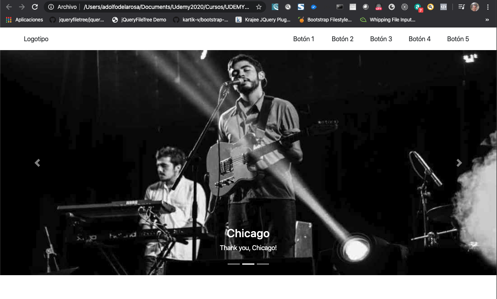

# 2. Bootstrap 4 01:13:49

Referencias

https://getbootstrap.com/

https://www.w3schools.com/bootstrap4/

http://bootstrap4.guide/

https://w3layouts.com/


## ¿Qué es Bootstrap? 07:20

* Bootstrap es un marco de trabajo o framework de libre uso para hacer del desarrollo web algo más rápido y más fácil.
* Bootstrap incluye plantillas de diseño basadas en HTML y CSS con tipografías, formas, botones, tablas de navegación modales, carruseles de imágenes y muchos otros elementos, así como complementos opcionales de JS.
* Bootstrap también da la posibilidad de crear fácilmente diseños que responden a cualquier pantalla o dispositivo.


## Instalación de Bootstrap 4 11:26


### 1. Usando CDN

Insertamos el código MaxCDN ([página](https://www.w3schools.com/bootstrap4/bootstrap_get_started.asp)) dentro del header.

`index.html`:

```html
<!DOCTYPE html>
<html lang="en">
<head>
    <meta charset="UTF-8">
    <meta name="viewport" content="width=device-width, initial-scale=1.0">
    <meta http-equiv="X-UA-Compatible" content="ie=edge">
    <title>Document</title>

    <!-- Latest compiled and minified CSS -->
    <link rel="stylesheet" href="https://maxcdn.bootstrapcdn.com/bootstrap/4.4.1/css/bootstrap.min.css">

    <!-- jQuery library -->
    <script src="https://ajax.googleapis.com/ajax/libs/jquery/3.4.1/jquery.min.js"></script>

    <!-- Popper JS -->
    <script src="https://cdnjs.cloudflare.com/ajax/libs/popper.js/1.16.0/umd/popper.min.js"></script>

    <!-- Latest compiled JavaScript -->
    <script src="https://maxcdn.bootstrapcdn.com/bootstrap/4.4.1/js/bootstrap.min.js"></script>
</head>
<body>
    
</body>
</html>
```

### 2. Forma Local

Para instalar localmente Bootstrapt tengo que crearme una estructura como la siguiente e copiar los archivos CSS y JS a la carpeta correspondiente.


Y en mi archivo HTML hacer el llamado a mis archivos locales:

```html
<!DOCTYPE html>
<html lang="en">
<head>
    <meta charset="UTF-8">
    <meta name="viewport" content="width=device-width, initial-scale=1.0">
    <meta http-equiv="X-UA-Compatible" content="ie=edge">
    <title>Document</title>

    <!-- Latest compiled and minified CSS -->
    <link rel="stylesheet" href="css/bootstrap.min.css">

    <!-- jQuery library -->
    <script src="js/jquery.min.js"></script>

    <!-- Popper JS -->
    <script src="js/popper.min.js"></script>

    <!-- Latest compiled JavaScript -->
    <script src="js/bootstrap.min.js"></script>
</head>
<body>
    
</body>
</html>
```


[Referencias](https://www.w3schools.com/bootstrap4/bootstrap_ref_all_classes.asp)

## Sistema de Grids (Rejillas) 19:05

[Grid System](https://www.w3schools.com/bootstrap4/bootstrap_grid_basic.asp)


```html
<meta name="viewport" content="width=device-width, initial-scale=1">
```
[Código tomado de 2. **Bootstrap 4 is mobile-first**](https://www.w3schools.com/bootstrap4/bootstrap_get_started.asp)

Este código va dentro de la HEAD.


En el sistema de Grids o Rejillas Bootstrap usa un máximo de 12 columnas.

Independiente del tamaño de pantalla nosotros trabajaremos con columnas.


Me puedo auxiliar de las herramientas de desarrollador para ver el Diseño Responsive y cambiar a los tamaños de resoluciones permitidos.

* Full HD - HD: 1920px
* Portatil: 1366px
* Tablet Horizontal: 1024px
* Tablet Vertical 768px
* Móvil Horizontal: 576px
* Móvil Vertical: 320px


**En cualquiera de estos 12 tamaños puedo tener hasta 12 columnas**


[Grid Options](https://www.w3schools.com/bootstrap4/bootstrap_grid_system.asp)

### Trabajar con Sistemas de Grids de Bootstrap

Lo primero que debemos definir en un sistema Grid de Bootstrap es un **Contenedor** y tenemos dos tipos:

* **`container`**
* **`container-fluid`**

Si usamos `container` tendremos **tamaños fijos para el contenedor según el tamaño del dispositivo** que estemos usando, como podemos ver en la siguiente tabla:


Si en lugar de usar `container` usamos `container-fluid` el contenedor usara todo el ancho de la página independientemente del dispositivo que usemos.

```html
<body> 
    <div class="container-fluid">

    </div>
</body>
```

Dentro del contenedor tendremos filas o renglones las cuales definimos con la clase `row`:

```html
<body> 
    <div class="container-fluid">
        <div class="row">

        </div>
    </div>
</body>
```

Dentro de la fila creamos nuestras columnas con la diferentes clases que tenemos:

* `col-N`
* `col-sm-N`
* `col-md-N`
* `col-lg-N`
* `col-xl-N`

**N**: Número del 1-12

```html
<body> 
    <div class="container-fluid">
        <div class="row">
            <div class="col-12">Col 12</div>
            <div class="col-6">Col 6</div>
            <div class="col-6">Col 6</div>
        </div>
    </div>
</body>
```

Veamos el siguiente código y su salida:

```html
<!DOCTYPE html>
<html lang="en">
<head>
    <meta charset="UTF-8">
    <meta name="viewport" content="width=device-width, initial-scale=1.0">
    <meta http-equiv="X-UA-Compatible" content="ie=edge">
    <title>Document</title>

    <!-- Latest compiled and minified CSS -->
    <link rel="stylesheet" href="css/bootstrap.min.css">

    <!-- jQuery library -->
    <script src="js/jquery.min.js"></script>

    <!-- Popper JS -->
    <script src="js/popper.min.js"></script>

    <!-- Latest compiled JavaScript -->
    <script src="js/bootstrap.min.js"></script>
</head>
<body> 
    <div class="container-fluid">
        <div class="row">
            <div class="col-12 bg-danger">Col 12</div>
            
            <div class="col-6 bg-primary">Col 6</div>
            <div class="col-6 bg-secondary">Col 6</div>
            
            <div class="col-4 bg-success">Col 4</div>
            <div class="col-4 bg-warning">Col 4</div>
            <div class="col-4 bg-info">Col 4</div>
            
            <div class="col-3 badge-danger">Col 3</div>
            <div class="col-3 bg-primary">Col 3</div>
            <div class="col-3 bg-secondary">Col 3</div>
            <div class="col-3 bg-success">Col 3</div>            
            
            <div class="col-2 bg-success">Col 2</div>
            <div class="col-2 badge-warning">Col 2</div>
            <div class="col-2 bg-info">Col 2</div>
            <div class="col-2 badge-danger">Col 2</div>
            <div class="col-2 bg-primary">Col 2</div>
            <div class="col-2 bg-secondary">Col 2</div>            
        </div>
    </div>
</body>
</html>
```


Si en lugar de `container-fluid` usamos `container` tenemos:


Tambien podemos ver la vista responsiva para cada uno de los tamaños de dispositivos:


## Las Clases CSS de Bootstrap 4 - Parte 1 18:43

[Bootstrap 4 Class Reference](https://www.w3schools.com/bootstrap4/bootstrap_ref_all_classes.asp)


[¿Diseño web responsive o diseño web mobile first?](https://www.novvamarketing.com/blog-marketing-digital/diseno-web-responsive-o-diseno-web-mobile-first/)

Hay dos opciones de empezar el diseño:

* Responsive
* Mobile First


### Colores 

Los colores podemos verlos en [Bootstrap 4 Colors](https://www.w3schools.com/bootstrap4/bootstrap_colors.asp)

#### Text Colors

Las clases para el color de los textos son: 

`.text-muted`, `.text-primary`, `.text-success`, `.text-info`, `.text-warning`, `.text-danger`, `.text-secondary`, `.text-white`, `.text-dark`, `.text-body` (default color del body /frecuentemente negro) and `.text-light`:

Ejemplo:

`textColor.html`:

```html
<!DOCTYPE html>
<html lang="en">
<head>
    <meta charset="UTF-8">
    <meta name="viewport" content="width=device-width, initial-scale=1.0">
    <meta http-equiv="X-UA-Compatible" content="ie=edge">
    <title>Document</title>

    <!-- Latest compiled and minified CSS -->
    <link rel="stylesheet" href="css/bootstrap.min.css">

    <!-- jQuery library -->
    <script src="js/jquery.min.js"></script>

    <!-- Popper JS -->
    <script src="js/popper.min.js"></script>

    <!-- Latest compiled JavaScript -->
    <script src="js/bootstrap.min.js"></script>
</head>
<body> 
    <div class="container">
        <h2>Colores contextuales</h2>
        <p>Utilice las clases contextuales para proporcionar "significado a través de colores":</p>
        <p class="text-muted">Este texto está silenciado.</p>
        <p class="text-primary">Este texto es importante.</p>
        <p class="text-success">Este texto indica éxito.</p>
        <p class="text-info">Este texto representa alguna información.</p>
        <p class="text-warning">Este texto representa una advertencia.</p>
        <p class="text-danger">Este texto representa peligro.</p>
        <p class="text-secondary">Texto secundario.</p>
        <p class="text-dark">Texto gris oscuro.</p>
        <p class="text-body">Color de default del body (a menudo negro).</p>
        <p class="text-light">Este texto es gris claro (sobre fondo blanco)</p>
        <p class="text-white">Este texto es blanco (sobre fondo blanco)</p>
      </div>
</body>
</html>
```


### Background Colors

Las clases para los colores de fondo son: `.bg-primary`, `.bg-success`, `.bg-info`, `.bg-warning`, `.bg-danger`, `.bg-secondary`, `.bg-dark` y `.bg-light`.

Tenga en cuenta que los colores de fondo no establecen el color del texto, por lo que en algunos casos querrá usarlos junto con una clase `.text-*`.

Ejemplo:

`backgroundColor.html`:

```html
<!DOCTYPE html>
<html lang="en">
<head>
    <meta charset="UTF-8">
    <meta name="viewport" content="width=device-width, initial-scale=1.0">
    <meta http-equiv="X-UA-Compatible" content="ie=edge">
    <title>Document</title>

    <!-- Latest compiled and minified CSS -->
    <link rel="stylesheet" href="css/bootstrap.min.css">

    <!-- jQuery library -->
    <script src="js/jquery.min.js"></script>

    <!-- Popper JS -->
    <script src="js/popper.min.js"></script>

    <!-- Latest compiled JavaScript -->
    <script src="js/bootstrap.min.js"></script>
</head>
<body> 
    <div class="container">
        <h2>Contextual Backgrounds</h2>
        <p>Utilice las clases contextual background para proporcionar  "significado a través de colores".</p>
        <p>Tenga en cuenta que también puede agregar una clase .text- * si desea un color de texto diferente:</p>
        <p class="bg-primary text-white">Este texto es importante.</p>
        <p class="bg-success text-white">Este texto indica éxito.</p>
        <p class="bg-info text-white">Este texto representa alguna información.</p>
        <p class="bg-warning text-white">Este texto representa una advertencia.</p>
        <p class="bg-danger text-white">Este texto representa peligro.</p>
        <p class="bg-secondary text-white">SColor de fondo secundario.</p>
        <p class="bg-dark text-white">Color de fondo gris oscuro.</p>
        <p class="bg-light text-dark">Color de fondo gris claro.</p>        
      </div>
</body>
</html>
```


### Margins y Paddings

[More Spacing Examples](https://www.w3schools.com/bootstrap4/bootstrap_utilities.asp)

class          |  acción
---------------|---------------------
.m-# / m-*-#   | margin on all sides	
.mt-# / mt-*-# | margin top	
.mb-# / mb-*-# | margin bottom	
.ml-# / ml-*-# | margin left	
.mr-# / mr-*-# | margin right	
.mx-# / mx-*-# | margin left and right	
.my-# / my-*-# | margin top and bottom	
.p-# / p-*-#   | padding on all sides	
.pt-# / pt-*-# | padding top	
.pb-# / pb-*-# | padding bottom	
.pl-# / pl-*-# | padding left	
.pr-# / pr-*-# | padding right	
.py-# / py-*-# | padding top and bottom	
.px-# / px-*-# | padding left and right

Ejemplo

`marginPadding.html`

```html
<!DOCTYPE html>
<html lang="en">
<head>
    <meta charset="UTF-8">
    <meta name="viewport" content="width=device-width, initial-scale=1.0">
    <meta http-equiv="X-UA-Compatible" content="ie=edge">
    <title>Document</title>

    <!-- Latest compiled and minified CSS -->
    <link rel="stylesheet" href="css/bootstrap.min.css">

    <!-- jQuery library -->
    <script src="js/jquery.min.js"></script>

    <!-- Popper JS -->
    <script src="js/popper.min.js"></script>

    <!-- Latest compiled JavaScript -->
    <script src="js/bootstrap.min.js"></script>
</head>
<body> 
    <div class="container">
        <h1>Utilidades de Espaciado</h1>
        <p>Establezca el espaciado de un elemento con las clases {property}{sides}-{breakpoint}-{size} classes. Omita breakpoint si desea que el relleno o el margen funcionen en todos los tamaños de pantalla.</p>
        <div class="pt-4 bg-warning">Solo tengo un top padding (1.5rem = 24px)</div>
        <div class="p-5 bg-success">Tengo un padding on all sides (3rem = 48px)</div>
        <div class="m-5 pb-5 bg-info">Tengo un margin en todos los lados (3rem = 48px) y un bottom padding (3rem = 48px)</div>
    </div>
</body>
</html>
```


### Ejemplo de Maquetación

Usando los elementos anteriores y algunos más como el Carrusel tenemos la siguiente maquetación:

Bootstrap 4 Carousel](https://www.w3schools.com/bootstrap4/bootstrap_carousel.asp)

```html
<!DOCTYPE html>
<html lang="en">
<head>
    <meta charset="UTF-8">
    <meta name="viewport" content="width=device-width, initial-scale=1.0">
    <meta http-equiv="X-UA-Compatible" content="ie=edge">
    <title>Document</title>

    <!-- Latest compiled and minified CSS -->
    <link rel="stylesheet" href="css/bootstrap.min.css">

    <!-- jQuery library -->
    <script src="js/jquery.min.js"></script>

    <!-- Popper JS -->
    <script src="js/popper.min.js"></script>

    <!-- Latest compiled JavaScript -->
    <script src="js/bootstrap.min.js"></script>
</head>
<body> 

    <!-- ================================================================
    CABECERA
    ==================================================================-->
    <div class="container-fluid">
        <div class="container">
            <div class="row">
                <div class="col-2 p-3">Logotipo</div>
                <div class="col-5 p-3"></div>
                <div class="col-1 p-3">Botón 1</div>
                <div class="col-1 p-3">Botón 2</div>
                <div class="col-1 p-3">Botón 3</div>
                <div class="col-1 p-3">Botón 4</div>
                <div class="col-1 p-3">Botón 5</div>
            </div>
        </div>
    </div>

    <!-- ================================================================
    SLIDE
    ==================================================================-->
    <div class="container-fluid p-0">
        <div id="demo" class="carousel slide" data-ride="carousel">
            <ul class="carousel-indicators">
                <li data-target="#demo" data-slide-to="0" class="active"></li>
                <li data-target="#demo" data-slide-to="1"></li>
                <li data-target="#demo" data-slide-to="2"></li>
            </ul>
            <div class="carousel-inner">
                <div class="carousel-item active">
                    
                    <div class="carousel-caption">
                        <h3>Los Angeles</h3>
                        <p>We had such a great time in LA!</p>
                    </div>   
                </div>
                <div class="carousel-item">
                    
                    <div class="carousel-caption">
                        <h3>Chicago</h3>
                        <p>Thank you, Chicago!</p>
                    </div>   
                </div>
                <div class="carousel-item">
                    
                    <div class="carousel-caption">
                        <h3>New York</h3>
                        <p>We love the Big Apple!</p>
                    </div>   
                </div>
            </div>
            <a class="carousel-control-prev" href="#demo" data-slide="prev">
                <span class="carousel-control-prev-icon"></span>
            </a>
            <a class="carousel-control-next" href="#demo" data-slide="next">
                <span class="carousel-control-next-icon"></span>
            </a>
        </div>
    </div>

</body>
</html>
```





## Las Clases CSS de Bootstrap 4 - Parte 2 13:50

## Diviértete con Bootstrap 4 03:25

## Aterrizando conceptos de Bootstrap 4 - 12 preguntas
