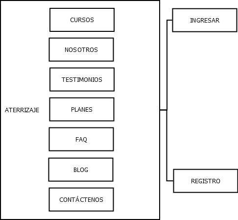
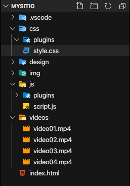
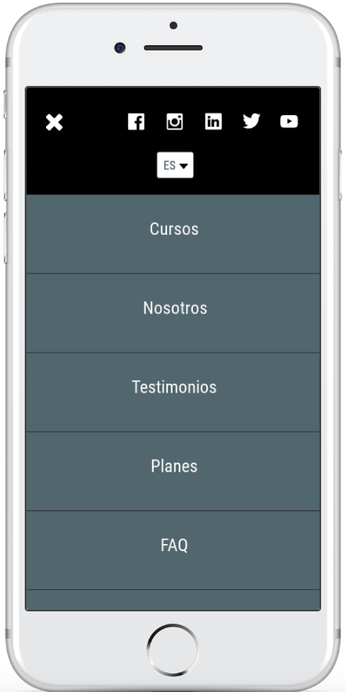

# 7. Arquitectura Front-End para el sitio web - Ventas por suscripción 02:06:59

* Organizando el proyecto - Ventas por suscripción 11:36
* Construyendo el Header 19:47
* Hero Image - Cinemagraph 16:13
* Construyendo la sección de Cursos 13:41
* Construyendo la sección de Nosotros 02:13
* Construyendo la sección de Testimonios 02:30
* Construyendo la sección de Planes 04:07
* Construyendo la sección FAQ 08:14
* Construyendo el Footer 04:50
* Configurando animación al Scroll 06:31
* Plugin Preloader 10:37
* Construyendo la página de Ingreso 11:08
* Construyendo la página de Registro 15:32


## Organizando el proyecto - Ventas por suscripción 11:36


### Etapa 1 Diseño y Planeación

* [Brief](https://github.com/adolfodelarosades/UDEMY-M-ster-en-Front-End-Bootstrap4-Flexbox-CSSGrid-WordPress/blob/master/pdf/Brief%20y%20Concepto%20-%20ventas%20por%20suscripci%C2%A2n.pdf)
* Site Map

   
* [Wireframe PC](https://marvelapp.com/eggg919/screen/48145028)
* [Wireframe para móviles](https://marvelapp.com/44j77e0/screen/48223352)
* [Layout PC](https://marvelapp.com/eggg919/screen/48785985)
* [Layout Móvil](https://marvelapp.com/44j77e0/screen/48787885)
* Imagenes optimizadas con [tinypng](https://tinypng.com/)
* Videos
* Crear Estructura del proyecto

   

#### Consejo para Desarrollar el Diseño

Abrir 5 navegadores páginas del navegador para ver la página en sus diferentes tamaños.

1. Pagina Normal
2. Vista Responsive 1024 x 768 (Tablet Horizontal)
3. Vista Responsive 768 x 1024 (Tablet Vertical)
4. Vista Responsive 576 x 320 (Movil Horizontal)
5. Vista Responsive 320 x 576 (Movil Vertical)

Tener disponibles las siguientes dos páginas:

1. [Bootstrap 4](https://www.w3schools.com/bootstrap4/default.asp)
2. [Font Awesome](https://fontawesome.com/)

### Inicializar Estilos CSS

En nuestro archivo `style.css` inicializaremos algunos elementos:

```css
/*=============================================
GLOBAL
=============================================*/

*{
	font-family: 'Roboto', sans-serif;
	font-weight:900;
	
}

a, h1, h2, h3, h4, h5, h6, button, select, option, .input-group, input, .input-group-text, textarea, .nav-link{
	font-family: 'Roboto Condensed', sans-serif;
}

ul, ol{
	list-style: none;
}

a:visited, a:link, a:focus, a:hover, a:active{
	list-style: none;
	text-decoration: none;
}
```

## Construyendo el Header 19:47


Si observo el [Layout PC](https://marvelapp.com/eggg919/screen/48785985) el header consta de 3 partes:


En el [Layout Móvil](https://marvelapp.com/44j77e0/screen/48787885) podemos ver que para el Móvil el header cambia:


Si damos un click en el menú hamburguesa vemos lo siguiente:



### Antes de nada recordemos los siguiente:

Grid Classes

El Bootstrap 4 grid system tiene 5 clases:

clase | Descripción
------|------------
`.col-` | (extra small devices - ancho de pantalla inferior a 576px)
`.col-sm-` | (small devices - ancho de pantalla igual o mayor que 576px)
`.col-md-` | (medium devices - ancho de pantalla igual o mayor que 768px)
`.col-lg-` | (large devices - ancho de pantalla igual o mayor que 992px)
`.col-xl-` | (xlarge devices - ancho de pantalla igual o mayor que 1200px)

Vamos a construir esta cabecera.


```html
<!--=====================================
HEADER
======================================-->

<header>

	<div class="container-fluid">
		
		<div class="container p-0">

			<div class="row">

				<!-- LOGO -->
			
				<div class="col-7 col-sm-5 col-md-4 col-lg-2 col-xl-3 my-3 d-flex mt-lg-4 mt-xl-3 logotipo">


				</div>

				<!-- BOTONERA -->

				<div class="d-none d-lg-block col-lg-8 col-xl-6 p-0 pt-4 botonera">
					

				</div>	

				<!-- IDIOMA E INGRESO -->

				<div class="col-5 col-sm-7 col-md-8 col-lg-2 col-xl-3 p-0 pt-4">


				</div>	

			</div>

		</div>

	</div>

</header>	
```

Podemos ver las tres secciones de las que consta el header:

* Logotipo
* Botonera
* Idioma e Ingreso

En el Logo tenemos:

```html
<!-- LOGO -->
			
<div class="col-7 col-sm-5 col-md-4 col-lg-2 col-xl-3 my-3 d-flex logotipo mt-lg-4 mt-xl-3">


</div>
```

`col-xl-3` 3 columnas para dispositivos xlarge (1200px ↑)
`col-lg-2` 2 columnas para dispositivos large (992px ↑)
`col-md-4` 4 columnas para dispositivo medium (768px ↑)
`col-sm-5` 5 columnas para dispositivos small (576px ↑)
`col-7` 7 columnas para dispositivos extra small (575px ↓)

`my-3` margen vertical de 3 unidades

`d-flex` clase flexbox para poder trabajar con dos elementos (menú hamburguesa y logotipo SOLO EN MOVILES) dentro de esta etiqueta

`mt-lg-4` margen top de 4 unidades para dispositivos large
`mt-xl-3` margen top de 3 unidades para dispositivos xlarge

`logotipo` nombre de la clase para su identificacion

En la Botonera tenemos:

```html
<!-- BOTONERA -->

<div class="d-none d-lg-block col-lg-8 col-xl-6 p-0 pt-4 botonera">
					

</div>	
```

`d-none` ocultar en pantallas pequeñas
`d-lg-block` a partir de dispositivos large se va a visualizar (992px ↑)

`col-lg-8` 8 columnas para dispositivos large (992px ↑)
`col-xl-6` 6 columnas para dispositivos xlarge (1200px ↑)

`p-0` anulamos el paddin en todos los lados
`pt-4` colocamos paddin top de 4 unidades

`botonera` nombre de la clase para su identificacion


## Hero Image - Cinemagraph 16:13
## Construyendo la sección de Cursos 13:41
## Construyendo la sección de Nosotros 02:13
## Construyendo la sección de Testimonios 02:30
## Construyendo la sección de Planes 04:07
## Construyendo la sección FAQ 08:14
## Construyendo el Footer 04:50
## Configurando animación al Scroll 06:31
## Plugin Preloader 10:37
## Construyendo la página de Ingreso 11:08
## Construyendo la página de Registro 15:32
