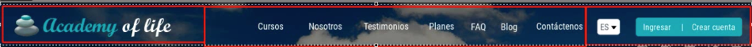
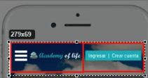

# 7. Arquitectura Front-End para el sitio web - Ventas por suscripción 02:06:59

* Organizando el proyecto - Ventas por suscripción 11:36
* Construyendo el Header 19:47
* Hero Image - Cinemagraph 16:13
* Construyendo la sección de Cursos 13:41
* Construyendo la sección de Nosotros 02:13
* Construyendo la sección de Testimonios 02:30
* Construyendo la sección de Planes 04:07
* Construyendo la sección FAQ 08:14
* Construyendo el Footer 04:50
* Configurando animación al Scroll 06:31
* Plugin Preloader 10:37
* Construyendo la página de Ingreso 11:08
* Construyendo la página de Registro 15:32


## Organizando el proyecto - Ventas por suscripción 11:36


### Etapa 1 Diseño y Planeación

* [Brief](https://github.com/adolfodelarosades/UDEMY-M-ster-en-Front-End-Bootstrap4-Flexbox-CSSGrid-WordPress/blob/master/pdf/Brief%20y%20Concepto%20-%20ventas%20por%20suscripci%C2%A2n.pdf)
* Site Map

   
* [Wireframe PC](https://marvelapp.com/eggg919/screen/48145028)
* [Wireframe para móviles](https://marvelapp.com/44j77e0/screen/48223352)
* [Layout PC](https://marvelapp.com/eggg919/screen/48785985)
* [Layout Móvil](https://marvelapp.com/44j77e0/screen/48787885)
* Imagenes optimizadas con [tinypng](https://tinypng.com/)
* Videos
* Crear Estructura del proyecto

   

#### Consejo para Desarrollar el Diseño

Abrir 5 navegadores páginas del navegador para ver la página en sus diferentes tamaños.

1. Pagina Normal
2. Vista Responsive 1024 x 768 (Tablet Horizontal)
3. Vista Responsive 768 x 1024 (Tablet Vertical)
4. Vista Responsive 576 x 320 (Movil Horizontal)
5. Vista Responsive 320 x 576 (Movil Vertical)

Tener disponibles las siguientes dos páginas:

1. [Bootstrap 4](https://www.w3schools.com/bootstrap4/default.asp)
2. [Font Awesome](https://fontawesome.com/)

### Inicializar Estilos CSS

En nuestro archivo `style.css` inicializaremos algunos elementos:

```css
/*=============================================
GLOBAL
=============================================*/

*{
	font-family: 'Roboto', sans-serif;
	font-weight:900;
	
}

a, h1, h2, h3, h4, h5, h6, button, select, option, .input-group, input, .input-group-text, textarea, .nav-link{
	font-family: 'Roboto Condensed', sans-serif;
}

ul, ol{
	list-style: none;
}

a:visited, a:link, a:focus, a:hover, a:active{
	list-style: none;
	text-decoration: none;
}
```

## Construyendo el Header 19:47


Si observo el [Layout PC](https://marvelapp.com/eggg919/screen/48785985) el header consta de 3 partes:



En el [Layout Móvil](https://marvelapp.com/44j77e0/screen/48787885) podemos ver que para el Móvil el header cambia:



Si damos un click en el menú hamburguesa vemos lo siguiente:


### Antes de nada recordemos los siguiente:

Grid Classes

El Bootstrap 4 grid system tiene 5 clases:

clase | Descripción
------|------------
`.col-` | (extra small devices - ancho de pantalla inferior a 576px)
`.col-sm-` | (small devices - ancho de pantalla igual o mayor que 576px)
`.col-md-` | (medium devices - ancho de pantalla igual o mayor que 768px)
`.col-lg-` | (large devices - ancho de pantalla igual o mayor que 992px)
`.col-xl-` | (xlarge devices - ancho de pantalla igual o mayor que 1200px)

### Construir Cabecera o Menú

Vamos a construir esta cabecera. Sabemos que el Header se compone de tres secciones:

* Logotipo
* Botonera
* Idioma e Ingreso

Nuestro código para construir estas tres secciones en el Header es el siguiente
```html
<!--=====================================
HEADER
======================================-->

<header>

	<div class="container-fluid">
		
		<div class="container p-0">

			<div class="row">

				<!-- LOGO -->
			
				<div class="col-7 col-sm-5 col-md-4 col-lg-2 col-xl-3 my-3 d-flex mt-lg-4 mt-xl-3 logotipo">


				</div>

				<!-- BOTONERA -->

				<div class="d-none d-lg-block col-lg-8 col-xl-6 p-0 pt-4 botonera">
					

				</div>	

				<!-- IDIOMA E INGRESO -->

				<div class="col-5 col-sm-7 col-md-8 col-lg-2 col-xl-3 p-0 pt-4">


				</div>	

			</div>

		</div>

	</div>

</header>	
```

** Descripción Sección Logo**

```html
<!-- LOGO -->
			
<div class="col-7 col-sm-5 col-md-4 col-lg-2 col-xl-3 my-3 d-flex logotipo mt-lg-4 mt-xl-3">


</div>
```

`col-7` 7 columnas para dispositivos extra small (575px ↓)
`col-sm-5` 5 columnas para dispositivos small (576px ↑)
`col-md-4` 4 columnas para dispositivo medium (768px ↑)
`col-lg-2` 2 columnas para dispositivos large (992px ↑)
`col-xl-3` 3 columnas para dispositivos xlarge (1200px ↑)

`my-3` margen vertical de 3 unidades

`d-flex` clase flexbox para poder trabajar con dos elementos (menú hamburguesa y logotipo SOLO EN MOVILES) dentro de esta etiqueta

`mt-lg-4` margen top de 4 unidades para dispositivos large
`mt-xl-3` margen top de 3 unidades para dispositivos xlarge

`logotipo` nombre de la clase para su identificacion

** Descripción Sección Botonera**

```html
<!-- BOTONERA -->

<div class="d-none d-lg-block col-lg-8 col-xl-6 p-0 pt-4 botonera">
					

</div>	
```

`d-none` ocultar en pantallas pequeñas
`d-lg-block` a partir de dispositivos large se va a visualizar (992px ↑)

`col-lg-8` 8 columnas para dispositivos large (992px ↑)
`col-xl-6` 6 columnas para dispositivos xlarge (1200px ↑)

`p-0` anulamos el paddin en todos los lados
`pt-4` colocamos paddin top de 4 unidades

`botonera` nombre de la clase para su identificacion

**Descripción Sección Idiomas e Ingreso** 

```html
<!-- IDIOMA E INGRESO -->

<div class="col-5 col-sm-7 col-md-8 col-lg-2 col-xl-3 p-0 pt-4">


</div>	
```

`col-5` 5 columnas para dispositivos extra small (575px ↓)
`col-sm-7` 7 columnas para dispositivos small (576px ↑)
`col-md-8` 8 columnas para dispositivo medium (768px ↑)
`col-lg-2` 2 columnas para dispositivos large (992px ↑)
`col-xl-3` 3 columnas para dispositivos xlarge (1200px ↑)

`p-0` anulamos el paddin en todos los lados
`pt-4` colocamos paddin top de 4 unidades

#### Detallando el Logo

Una vez que tenemos definida la sección del Logo vamos a meterle contenido, el cual consiste en:

* Menú Hamburguesa
* Logotipo

```html
<!-- LOGO -->
			
<div class="col-7 col-sm-5 col-md-4 col-lg-2 col-xl-3 my-3 d-flex mt-lg-3 logotipo">

	<i class="fas fa-bars d-block d-lg-none text-white pt-2 pr-2"></i>
					
	<a href="index.html">
		
	</a>

</div>
```

**Descripción Menú Hamburguesa**

Sabemos que para pintar el [icono de bars de fontawesome](https://fontawesome.com/icons/bars) usamos el código:

```html
<i class="fas fa-bars"></i>
```


Entonces para nuestro menú hamburguesa tenemos:

```html
<i class="fas fa-bars d-block d-lg-none text-white pt-2 pr-2"></i>
```

`d-block` visualizar el icono
`d-lg-none` ocultar el icono apartir de dispositivos large
`text-white` texto blanco
`pt-2` padding top de 2 unidades
`pr-2` padding rigth de 2 unidades

**Descripción Logotipo**

Tenemos una imagen con un enlace a nuestra página `index.htlm`
```html
<a href="index.html">
	
</a>
```

`img-fluid` La clase `.img-fluid` aplica `max-width: 100%;` y `height: auto;` a la imagen.  La imagen se escalará bien al elemento padre. 
`pt-1` padding top de 1 unidad

#### Detalle de la Botonera

Vamos a meter el contenido dentro de la seccion de la botonera.

Segun la documentación de [Bootstrap 4 Navs](https://www.w3schools.com/bootstrap4/bootstrap_navs.asp) Si desea crear un menú horizontal simple, agregue la clase `.nav` a un elemento `<ul>`, seguido de `.nav-item` para cada `<li>` y agregue la clase `.nav-link` a sus enlaces:

```html
<!-- BOTONERA -->

<div class="d-none d-lg-block col-lg-8 col-xl-6 p-0 pt-lg-2 mt-lg-1 pt-xl-4 botonera">
					
	<ul class="nav justify-content-lg-left justify-content-xl-end">
						
		<li class="nav-item">
			<a class="nav-link text-white" href="#cursos">Cursos</a>
		</li>

		<li class="nav-item">
			<a class="nav-link text-white" href="#nosotros">Nosotros</a>
		</li>

		<li class="nav-item">
			<a class="nav-link text-white" href="#testimonios">Testimonios</a>
		</li>

		<li class="nav-item">
			<a class="nav-link text-white" href="#planes">Planes</a>
		</li>

		<li class="nav-item">
			<a class="nav-link text-white" href="#faq">FAQ</a>
		</li>

		<li class="nav-item">
			<a class="nav-link text-white" href="#">Blog</a>
		</li>

		<li class="nav-item">
			<a class="nav-link text-white" href="#contactenos">Contáctenos</a>
		</li>

	</ul>

</div>	
```

La botonera incluye un elemento `ul`:

```html
<ul class="nav justify-content-lg-left justify-content-xl-end">
```

`nav` clase `nav`
`justify-content-lg-left` justifica el contenido a la izquierda para dispositivos large (992px ↑)
`justify-content-xl-end` justifica el contenido al final para dispositivos xlarge (1200px ↑)

Y dentro del `ul` incluye sus elemento `li`

```html
<li class="nav-item">
	<a class="nav-link text-white" href="#cursos">Cursos</a>
</li>
```

Con sus respectivos enlaces(internos).

#### Detalle de Idiomas e Ingreso

Dentro de esta sección de Idiomas e Ingreso tendremos dos bloques uno para Idimas y otro para Ingresos:

```html
<!-- IDIOMA E INGRESO -->

<div class="col-5 col-sm-7 col-md-8 col-lg-2 col-xl-3 p-0 pt-4 pt-lg-2 mt-lg-1 pt-xl-4">

	<!-- IDIOMA -->
					
	<div class="ml-xl-4 float-left mt-lg-1 d-none d-lg-block">

		<div class="dropdown">

			<button type="button" class="btn btn-light btn-sm dropdown-toggle" data-toggle="dropdown">
				ES
			</button>

			<div class="dropdown-menu">
				<a class="dropdown-item" href="#">EN</a>
			</div>

		</div>

	</div>

	<!-- INGRESO -->

	<div class="mr-2 mr-lg-0 float-right pt-1 ingresos">
						
		<button class="btn btn-info btn-sm d-flex">
							
			<a href="ingreso.html" class="text-white">Ingresar</a>

			<span class="text-white mx-2">|</span>

			<a href="registro.html" class="text-white">Crear Cuenta</a>
			
		</button>

	</div>

</div>	
```

##### Bloque Idioma

```html
<!-- IDIOMA -->
					
<div class="ml-xl-4 float-left mt-lg-1 d-none d-lg-block">

	<div class="dropdown">

		<button type="button" class="btn btn-light btn-sm dropdown-toggle" data-toggle="dropdown">
		ES
		</button>

		<div class="dropdown-menu">
			<a class="dropdown-item" href="#">EN</a>
		</div>

	</div>

</div>
```

El Idioma es una división con las seguientes características:

`ml-xl-4` 4 unidades de margin left para dispositivos xlarge (1200px ↑)
`float-left` divisisión que flota a la izquierda
`mt-lg-1` 1 unidad de margin top para dispositivos large (992px ↑)
`d-none` se oculta en dispositivos
`d-lg-block` se muestra a partir de dispositivos large (992px ↑)

Tiene un `dropdown` [Bootstrap 4 Dropdowns](https://www.w3schools.com/bootstrap4/bootstrap_dropdowns.asp)

Un `dropdown` (menú desplegable) es un menú que permite al usuario elegir un valor de una lista predefinida.

El código se tomo del ejemplo de la documentación y solo se cambiaron los nombres de las opciones `ES`, `EN`.

##### Bloque Ingreo

```html
<!-- INGRESO -->

<div class="mr-2 mr-lg-0 float-right pt-1 ingresos">
						
	<button class="btn btn-info btn-sm d-flex">
							
		<a href="ingreso.html" class="text-white">Ingresar</a>

		<span class="text-white mx-2">|</span>

		<a href="registro.html" class="text-white">Crear Cuenta</a>
			
	</button>

</div>
```

Este bloque de Ingreso es una división con las siguientes caracteristicas:

`mr-2` margin right de 2 unidades
`mr-lg-0` margin right de 0 unidades para dispositivos large (992px ↑)
`float-right` división que flotara a la derecha
`pt-1` pading top de 1 unidad
`ingresos` nombre del bloque

Dentro contiene un botón [Bootstrap 4 Buttons](https://www.w3schools.com/bootstrap4/bootstrap_buttons.asp):

```html
<button class="btn btn-info btn-sm d-flex">
							
	<a href="ingreso.html" class="text-white">Ingresar</a>

	<span class="text-white mx-2">|</span>

	<a href="registro.html" class="text-white">Crear Cuenta</a>
			
</button>
```

Usamos `d-flex` dentro del botón por que tenemos tres elementos `Ingresos | Crear Cuenta`

### Visualizar lo Construido Hasta el Momento.

Vamos a visualizar el código construido hasta el momento, solo cabe aclarar que se le ha puesto un color de fondo al encabezado para poder visualizar el texto de las opciones de la botonera. El código completo es el siguiente:

```html
<!DOCTYPE html>
<html lang="en">
<head>
	<meta charset="UTF-8">

	<meta name="viewport" content="width=device-width, initial-scale=1">

	<title>Academy of life</title>

	<link rel="icon" href="img/icono.png">

	<!--=====================================
	VÍNCULOS CSS
	======================================-->

	<!-- Latest compiled and minified CSS -->
	<link rel="stylesheet" href="https://maxcdn.bootstrapcdn.com/bootstrap/4.1.0/css/bootstrap.min.css">

	<!-- Font Awesome -->
	<link rel="stylesheet" href="https://use.fontawesome.com/releases/v5.7.2/css/all.css" integrity="sha384-fnmOCqbTlWIlj8LyTjo7mOUStjsKC4pOpQbqyi7RrhN7udi9RwhKkMHpvLbHG9Sr" crossorigin="anonymous">

	<!-- Fuente Open Sans -->
	<link href="https://fonts.googleapis.com/css?family=Roboto+Condensed|Roboto:100|Grand+Hotel" rel="stylesheet">

	<!-- Hoja Estilo Personalizada -->
	<link rel="stylesheet" href="css/style.css">

	<!--=====================================
	VÍNCULOS JAVASCRIPT
	======================================-->

	<!-- jQuery library -->
	<script src="https://ajax.googleapis.com/ajax/libs/jquery/3.3.1/jquery.min.js"></script>

	<!-- Popper JS -->
	<script src="https://cdnjs.cloudflare.com/ajax/libs/popper.js/1.14.0/umd/popper.min.js"></script>

	<!-- Latest compiled JavaScript -->
	<script src="https://maxcdn.bootstrapcdn.com/bootstrap/4.1.0/js/bootstrap.min.js"></script>

	<!-- https://easings.net/es# -->
	<script src="js/plugins/jquery.easing.js"></script>

	<!-- https://markgoodyear.com/labs/scrollup/ -->
	<script src="js/plugins/scrollUP.js"></script>

	<!-- https://www.jqueryscript.net/loading/Handle-Loading-Progress-jQuery-Nite-Preloader.html -->
	<script src="js/plugins/jquery.nite.preloader.js"></script>

</head>

<body>

<!--=====================================
HEADER
======================================-->

<header>

	<div class="container-fluid bg-primary">
		
		<div class="container p-0">

			<div class="row">

				<!-- LOGO -->
			
				<div class="col-7 col-sm-5 col-md-4 col-lg-2 col-xl-3 my-3 d-flex mt-lg-4 mt-xl-3 logotipo">

					<i class="fas fa-bars d-block d-lg-none text-white pt-2 pr-2"></i>
					
					<a href="index.html">
						
					</a>

				</div>

				<!-- BOTONERA -->

				<div class="d-none d-lg-block col-lg-8 col-xl-6 p-0 pt-lg-2 mt-lg-1 pt-xl-4 botonera">
					
					<ul class="nav justify-content-lg-left justify-content-xl-end">
						
						<li class="nav-item">
							<a class="nav-link text-white" href="#cursos">Cursos</a>
						</li>

						<li class="nav-item">
							<a class="nav-link text-white" href="#nosotros">Nosotros</a>
						</li>

						<li class="nav-item">
							<a class="nav-link text-white" href="#testimonios">Testimonios</a>
						</li>

						<li class="nav-item">
							<a class="nav-link text-white" href="#planes">Planes</a>
						</li>

						<li class="nav-item">
							<a class="nav-link text-white" href="#faq">FAQ</a>
						</li>

						<li class="nav-item">
							<a class="nav-link text-white" href="#">Blog</a>
						</li>

						<li class="nav-item">
							<a class="nav-link text-white" href="#contactenos">Contáctenos</a>
						</li>

					</ul>

				</div>	

				<!-- IDIOMA E INGRESO -->

				<div class="col-5 col-sm-7 col-md-8 col-lg-2 col-xl-3 p-0 pt-4 pt-lg-2 mt-lg-1 pt-xl-4">

					<!-- IDIOMA -->
					
					<div class="ml-xl-4 float-left mt-lg-1 d-none d-lg-block">

						<div class="dropdown">

							<button type="button" class="btn btn-light btn-sm dropdown-toggle" data-toggle="dropdown">
							ES
							</button>

							<div class="dropdown-menu">

								<a class="dropdown-item" href="#">EN</a>

							</div>

						</div>

					</div>

					<!-- INGRESO -->

					<div class="mr-2 mr-lg-0 float-right pt-1 ingresos">
						
						<button class="btn btn-info btn-sm d-flex">
							
							<a href="ingreso.html" class="text-white">Ingresar</a>

							<span class="text-white mx-2">|</span>

							<a href="registro.html" class="text-white">Crear Cuenta</a>

						</button>

					</div>

				</div>		

			</div>

		</div>

	</div>

</header>	


<script src="js/script.js"></script>

</body>

</html>
````

Las pantallas de salida son:


## Hero Image - Cinemagraph 16:13
## Construyendo la sección de Cursos 13:41
## Construyendo la sección de Nosotros 02:13
## Construyendo la sección de Testimonios 02:30
## Construyendo la sección de Planes 04:07
## Construyendo la sección FAQ 08:14
## Construyendo el Footer 04:50
## Configurando animación al Scroll 06:31
## Plugin Preloader 10:37
## Construyendo la página de Ingreso 11:08
## Construyendo la página de Registro 15:32
